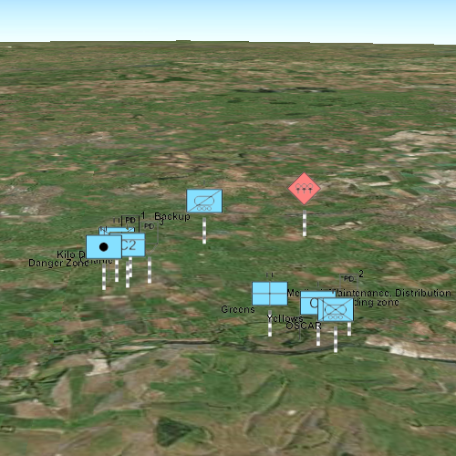

# Graphics overlay (dictionary renderer) 3D

This sample demonstrates applying a dictionary renderer to a graphics overlay in a 3D scene to display military symbology.

## How it works

The sample loads a number of point military elements from an XML file and adds them as graphics to a `GraphicsOverlay`. A `DictionaryRenderer` is applied to the `GraphicsOverlay` in order to display the graphics with MIL-STD-2525D military symbology. The `GraphicsOverlay`'s `renderingMode` parameter is set to `GraphicsRenderingModeDynamic`, so that point features are displayed with billboarded symbols facing the user (a developer can set `renderingMode` to `GraphicsRenderingModeStatic` if desired to instead drape the symbols on the surface). When all graphics are created, the 3D scene's viewpoint is set to zoom to the full extent of all graphics.

## Features
- SceneView
- Scene
- BasemapImagery
- GraphicsOverlay
- DictionaryRenderer
- DictionarySymbolStyle
- SpatialReference
- PointBuilder
- Graphic
- GeometryEngine

## Offline Data
Read more about how to set up the sample's offline data [here](http://links.esri.com/ArcGISRuntimeQtSamples).

Link | Local Location
---------|-------|
|[Mil2525d Stylx File](https://www.arcgis.com/home/item.html?id=e34835bf5ec5430da7cf16bb8c0b075c)| `<userhome>`/ArcGIS/Runtime/Data/styles/mil2525d.stylx |
|[MIL-STD-2525D XML Message File](https://arcgisruntime.maps.arcgis.com/home/item.html?id=3db12175479147ea9c89ebaaf3b89996)| `<userhome>`/ArcGIS/Runtime/Data/xml/Mil2525DMessages.xml |
