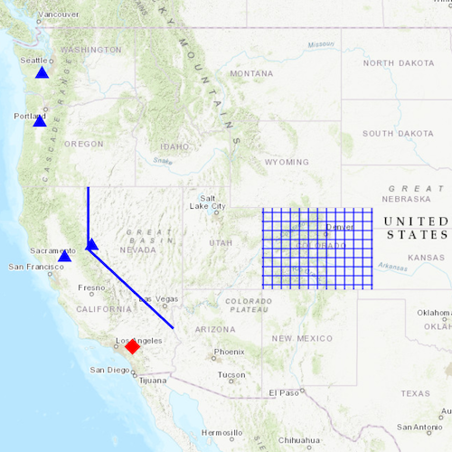

# Create geometries

Geometries are the underlying component to nearly any operation in Geographic Information Systems. For example, geometries can be displayed as graphics to perform visualization, stored as features in a database to represent real world features and assets, or used as inputs to spatial analysis tasks.

This sample demonstrates how to build the various Geometry objects that are supported in ArcGIS Runtime.

## How to use the sample
Open the sample and several point, line, and polygon symbols will display as Graphics on the Map.

## How it works
Geometries are immutable in the ArcGIS Runtime API, so `GeometryBuilder` objects must be used to build or modify a `Geometry`. In this case, a `MultipointBuilder`, `PolygonBuilder`, and `PolylineBuilder` are created by setting the spatial reference of the builder. XY points are then added to the builders to build the Geometry. Each point will be added as a new vertex in the Geometry. Once all of the vertices are added, the `geometry` property gives access to a `Geometry` object from the builder. Graphics are created from each `Geometry` that is created so that the `Geometry` can be displayed on the `Map`. Finally, the MapView's `Viewpoint` is set by creating an `Envelope`.

## Relevant API
 - Point
 - Multipoint
 - Polyline
 - Polygon
 - Envelope
 - PolygonBuilder
 - PolylineBuilder
 - MultipointBuilder

## Tags
Geometry, Point, Line, Polygon, Vector
